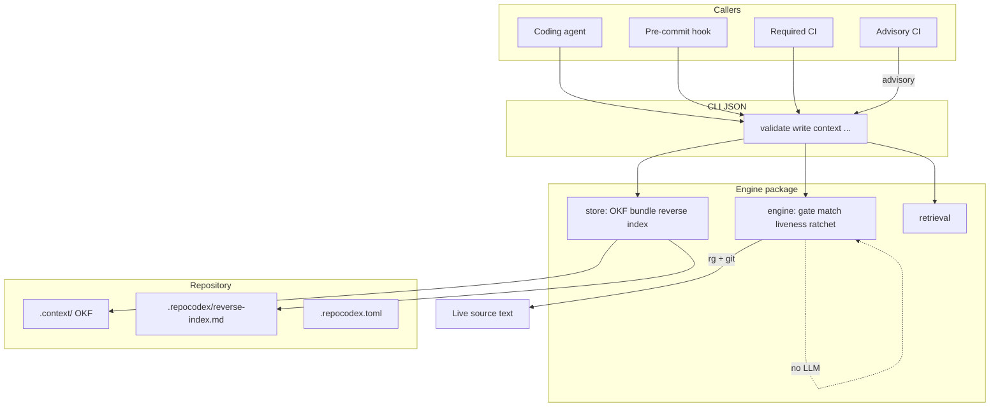

# RepoCodex engine architecture

**Status:** Current system (experimental `0.0.1`)  
**Audience:** Open-source users and engine contributors

RepoCodex is a repository-native **executable memory** framework for coding agents (and review agents on the same interfaces). It stores *why code exists* next to the code in git, proves each record is about live text with a deterministic attester (ripgrep + git), and serves scoped context through a CLI, packaged skills, and an optional MCP wrapper.

This document describes the **shipped engine**. For the product loop (retrieve → read → edit → update why → pin-check), start with [how-it-works.md](how-it-works.md).

**Positioning:** git-native memory that agents write, attest, and query — not a code-search engine, not another `AGENTS.md` (the pin check is the difference), not a static-analysis or test-suite replacement.



---

## 1. Goals and non-goals

### Goals

- Persist *why* next to *what*, in git, so it branches and merges with the code.
- Let the agent that writes the code also write the memory, in the same change.
- Prove every pinning memory record is about live code text (anchors + write gate) for any grep-able file.
- Keep retrieval token-cheap (reverse index + staged reads; never dump `.context/`).
- Make mechanical memory maintenance hard to skip (hook + required deterministic CI), with a governed human escape hatch.

### Non-goals

- Human authoring or per-record approval as a load-bearing step.
- Replacing Semgrep, ESLint, import-linter, ArchUnit, CodeQL, or other enforcement tools (RepoCodex can *pin* their configs).
- A persisted code graph, AST witnesses, Tree-sitter, SCIP, or ast-grep.
- Using an LLM as the liveness attester.
- Using a test suite as the product's check that existing scenarios still hold.

---

## 2. On-disk layout

| Path | Role |
| --- | --- |
| `.context/` | OKF v0.2 knowledge bundle: one concept per file; reserved `index.md` / `log.md` |
| `.context/index.md` | Root catalog; frontmatter is `okf_version: "0.2"` only |
| `.repocodex/reverse-index.md` | Generated path → concept map (committed). Shards: `.repocodex/reverse-index/<escaped>.md` |
| `.repocodex.toml` | Engine version pin, posture, ceilings, `scope_lines`, exclusions |
| `.repocodexignore` | Extra scan-exclusion globs |
| `.repocodex/metrics.jsonl` | Telemetry sink (gitignored); not memory |

Identity is the path relative to `.context/` with `.md` removed. How to read a concept: [memory.md](memory.md).

**Authored type folders** (required for new writes of the four authored types):

| Type | Identity prefix |
| --- | --- |
| `TechnicalDecision` | `decisions/` |
| `InvariantContract` | `invariants/` |
| `BusinessWorkflow` | `workflows/` |
| `GuardrailDecision` | `decisions/` or `guardrails/` |

New writes that violate the map are rejected (`identity_prefix_mismatch`). Existing flat files may be updated with a suggestion and appear in validate's advisory `identity_prefix_warnings`. `repocodex relocate` (or `--mismatched`) moves them.

### Anchors

```yaml
verification:
  engine: ripgrep
  anchors:
    - path: src/billing/PaymentGateway.ts
      all_of: ["ENTERPRISE", "grace", "= 3"]
      near: "capturePayment"   # optional
      scope_lines: 40          # optional; default from config (40)
      min_match: 2             # optional N-of-M (default: all terms)
```

`claims` freeze checkable literals against an owning anchor (optional `anchor` index). `InvariantContract` writes require at least one claim. Absence of a declared literal from the matched region at validate time is `CLAIM_BROKEN`.

Optional in-code `why:` markers may appear as at most one `all_of` term; the gate rejects marker-only anchors. There is **no** separate CI job that greps marker ↔ concept agreement.

---

## 3. Package map

This repository builds the engine. Layout:

| Path | Role |
| --- | --- |
| `src/repocodex/cli.py` | Typer entry; JSON envelopes; non-zero exit on failure |
| `src/repocodex/commands/` | Command implementations |
| `src/repocodex/engine/` | Deterministic attester — **no LLM** |
| `src/repocodex/store/` | OKF bundle and reverse index |
| `src/repocodex/tools/` | Thin ripgrep / git wrappers |
| `src/repocodex/schema.py` | Concept models, parse/serialize, envelopes |
| `src/repocodex/config.py` | Repo config and engine pin |
| `src/repocodex/retrieval.py` | Staged, ranked context retrieval |
| `src/repocodex/mcp_server.py` | Optional MCP wrapper |
| `src/repocodex/data/` | Packaged hooks, Action, skills, rules, plugin |

### Engine modules (attester)

| Module | Responsibility |
| --- | --- |
| `gate.py` | Write gate + identity prefixes |
| `match.py` | Term compile, regions, markers, claim helpers |
| `liveness.py` | LIVE / WEAK / REANCHOR / DRIFT + CLAIM_BROKEN |
| `relocate.py` | Rename + pickaxe candidates |
| `ratchet.py` | Skipped-memory / first-touch / region discharge |
| `contradiction.py` | Shared claim subject + double supersede |
| `impact.py` | Intent-side `impacted_scenarios` |
| `code_impact.py` | Code-side hit ranking (advisory) |
| `blocking.py` | Closed `REQUIRED_CHECK_REASONS` |
| `dilution.py` | Advisory dilution warnings |
| `ack.py` | Review-ack token helper for `memory-exempt` |

---

## 4. Write gate

`repocodex write` fails closed. Checks (ripgrep counts; no model):

1. **Match** — every anchor's terms hit the pinned path (with `near` / `scope_lines` when set).
2. **In-file uniqueness** — term combination locates a unique region (`ambiguous_in_file` otherwise).
3. **Distinctiveness** — at least one term under the configured ceiling; path-only and import-only rejected.
4. **Claims** — each `claims[].literal` appears in the owning anchor's `all_of` and matched region.
5. **Exclusions** — pins inside gitignored / `.repocodexignore`d / config exclusion paths rejected.
6. **Identity prefix** — authored types must live under the mapped folders (new writes).
7. **Markers / regex dialect** — marker-only and unsupported regex dialects rejected.

Reject payloads include `tighten`, `term_counts`, and `suggestions`.

---

## 5. Pin-check pipeline

`repocodex validate` classifies each intersecting stable anchor:

| Class | Meaning | Tree write? |
| --- | --- | --- |
| LIVE | ≥ `min_match` terms in pinned region | No |
| WEAK | Partial term loss | No (advisory) |
| REANCHOR | Unique relocation; patch emitted | Caller applies |
| DRIFT | Full miss, 0 or >1 candidates → result `RECONCILE` | After attested repair |
| CLAIM_BROKEN | Declared literal absent from owning matched region | After attested repair |

**Orthogonal:** an anchor can be LIVE while its claim is broken.

### Closed blocking set

From `engine/blocking.py` — the required check fails only for:

1. `drift` — unrepaired DRIFT
2. `claim_broken` — any claim finding
3. `skipped_memory` — covered-file maintenance or first-touch of an uncovered eligible file, undischarged
4. `index_sync` — committed reverse index out of sync with anchors
5. `contradiction` — two live concepts assert different literals for the same claim `subject`, or two live concepts supersede the same predecessor

Never blocks solely because `.context/` changed, WEAK degraded, dilution warned, or an agent-judged finding appeared.

### Skipped-memory ratchet

- Substantive edit to a **covered** file arms unless a concept *pinning that file* was added/modified in the same change, **or** every substantive hunk falls inside a matched region of an attesting anchor.
- A LIVE classification alone does **not** discharge the whole file.
- Substantive edit to an **uncovered** eligible file arms first-touch (`uncovered_file_without_memory`); result is `WRITE` until a pinning concept is written. Lockfiles and gitignore-class basenames do not arm.
- Comment/whitespace-only edits do not arm. Working-tree scope diffs against `HEAD`.

### Tree mutation honesty

Engine modules under `engine/` emit verdicts and patches; they do not write concepts. Callers apply patches (`reconcile --apply-patch`, optional `validate --apply-patches`). Exceptions outside the attester core:

- `validate` appends metrics to `.repocodex/metrics.jsonl`
- `audit` may deprecate orphan/expired drafts (GC)
- `write` / `reconcile` / `relocate` / `bootstrap` / `install` intentionally mutate the tree

Default validate without `--apply-patches` leaves `.context/` unchanged.

---

## 6. Retrieval and impact

**Retrieval** (`repocodex context`): reverse index → status filter → provenance/churn ranking → bodies for pinned concepts + one link-hop of titles. Tokens-per-turn is recorded on this command (payload chars / 4), not on validate.

**Intent-side impact** (deterministic): changed files → reverse index → concepts → OKF links → other pins. Included as `impacted_scenarios` in every validate envelope.

**Code-side impact** (advisory): `repocodex advisory` ranks symbol hits with a read cap. Judgment categories (`prose_versus_diff`, `skipped_recipe_steps`, `churn_flags`) stay `not_evaluated` unless a caller supplies findings. The advisory Action job runs this command; it is **not** an LLM review agent in CI. `required_verdict_unaffected` is always true.

---

## 7. Interfaces

The **CLI is canonical**; everything else wraps it. Output is JSON with `engine_version`.

| Command | Behavior |
| --- | --- |
| `validate` | Attest anchors (`--diff` / `--all` / `--staged` / `--check` / `--hook`). Optional `--apply-patches`, `--memory-exempt`, `--ack-file`. |
| `write` | Write gate; persist into `.context/`; regenerate reverse index on accept. |
| `relocate` | Move prefix-mismatched authored concepts to typed folders (`--mismatched`). |
| `reconcile` | Repair DRIFT via gate, or `--apply-patch` for REANCHOR. |
| `context` | Reverse-index staged retrieval. |
| `repair` | Re-validate; invoke first available harness (`cursor` → `claude` → `codex`) with a repair prompt. |
| `install` | Hook, Action, skills, Cursor rule, Claude pointer, plugin tree; optional `--mcp`. |
| `bootstrap` | Mine comments/history into gate-passing draft `TechnicalDecision`s. |
| `audit` | Sample stables for out-of-band screening; distinctiveness; GC. **`model_invoked` is always false.** Optional `--findings` JSON becomes contradiction proposals. |
| `advisory` | Non-blocking code-side impact envelope for the advisory CI job. |
| `mcp` | Start the optional MCP server (`repocodex[mcp]` extra required). |

### Validate envelope (shape)

Important keys (not exhaustive):

```json
{
  "result": "LIVE",
  "posture": "shadow",
  "blocking": false,
  "blocking_reasons": [],
  "outcomes": [],
  "lost": [],
  "weak": [],
  "claim_findings": [],
  "patches": [],
  "candidates": [],
  "impacted_scenarios": [],
  "dilution_warnings": [],
  "identity_prefix_warnings": [],
  "contradictions": [],
  "index_sync": [],
  "skipped_memory": [],
  "changed_files": [],
  "memory_exempt": false,
  "exemption_refused": null,
  "audit_entries": [],
  "repair_tasks": [],
  "false_drift_rate": 0.0,
  "latency_ms": 12.3,
  "engine_version": "0.0.1"
}
```

`result` may be `LIVE`, `WEAK`, `REANCHOR`, `RECONCILE`, `CLAIM_BROKEN`, `CONTRADICTION`, or `WRITE`. Claim breakage appears in **`claim_findings`**; the blocking reason string is `"claim_broken"`.

### MCP tools

`get_context`, `get_impact`, `read_concept`, `write_memory`, `validate_diff`, `reconcile_memory` — thin wrappers over CLI/command logic.

### Install artifacts

`repocodex install` writes:

- `.git/hooks/pre-commit` → `repocodex validate --diff --staged --hook`
- `.github/workflows/repocodex.yml` — required job (`validate --check`) + advisory job (`repocodex advisory`, `continue-on-error`)
- Skills under `.cursor/skills/` and `.claude/skills/`
- Cursor rule `.cursor/rules/repocodex.mdc` and a Claude pointer in `CLAUDE.md` when appropriate
- `.repocodex/plugin/` (Agent Plugins tree)
- `.repocodex.toml` if missing (default `posture = "shadow"`)

`repocodex install --mcp` merges stdio config into `.cursor/mcp.json` when the `mcp` extra is importable.

### `memory-exempt`

PR label (or `--memory-exempt`) clears blocking reasons only when acknowledgment evidence exists: tracked ack file, CI env evidence from a non-author approving review containing `repocodex-ack`, or the Action-resolved evidence path. Without evidence: `exemption_refused: missing_acknowledgment`. The CLI accepts a hidden `--review-ack` flag for compatibility; validate does **not** read it — ack comes from file / env / Action.

---

## 8. Config and postures

`.repocodex.toml` keys the engine actually reads: `engine_version`, `posture`, `distinctiveness_ceiling`, `scope_lines`, `exclusions`, `impact_read_cap`, `audit_sample_size`. Pin mismatch → refuse to run.

| Posture | Blocking behavior (as shipped) |
| --- | --- |
| `shadow` (default) | Blocks **only** on undischarged `skipped_memory` (including first-touch). Other required reasons are computed and reported but non-blocking. |
| `ratchet` | Any reason in the closed blocking set denies. |
| `full` | Same blocking behavior as `ratchet` in validate today. Scheduled sampling is the separate `repocodex audit` command, not a `full`-only CI gate. |

Reasons are always computed; only `blocking` differs by posture.

### Determinism (honest bounds)

- Distinctiveness **ceiling** is derived from tracked file count (`git ls-files`).
- Term **hit counts** at write time use working-tree ripgrep with exclusion globs (not tracked-only).
- First-touch can see **untracked** substantive files in the working tree.
- Engine pin is enforced so hook, local CLI, and CI resolve the same version.
- Regex dialect portability is a write-gate condition (reject terms whose semantics diverge between matcher and count paths).

---

## 9. Engine vs LLM

| Path | Technology | Decides? |
| --- | --- | --- |
| Anchor attest, gate, relocation, reverse index, required CI | ripgrep, git, thin Python CLI | Yes — deterministic |
| Draft why, choose terms, code-side judgment, repair proposals | Agent skills / models | No — proposal only |
| `repocodex audit` | Sampling + GC; optional external `--findings` | No model in-process |

---

## 10. Self-hosting note

This engine repository does **not** yet carry a `.context/` bundle. Engine pytest pins CLI and attester behavior; it is not how application scenarios are verified. Seeding OKF for this repo is a separate change.

---

## 11. Related docs

| Doc | Job |
| --- | --- |
| [how-it-works.md](how-it-works.md) | Purpose, benefit, product loop |
| [memory.md](memory.md) | How to read `.context/` |
| [agents.md](agents.md) | Agent (and optional human) playbook |
| [install.md](install.md) | CLI, pin, hook, Action, MCP |
| [CONTRIBUTING.md](../CONTRIBUTING.md) | Engine contributor setup / OpenSpec |

Language coverage is **anything grep-able**. There is no language allowlist.
