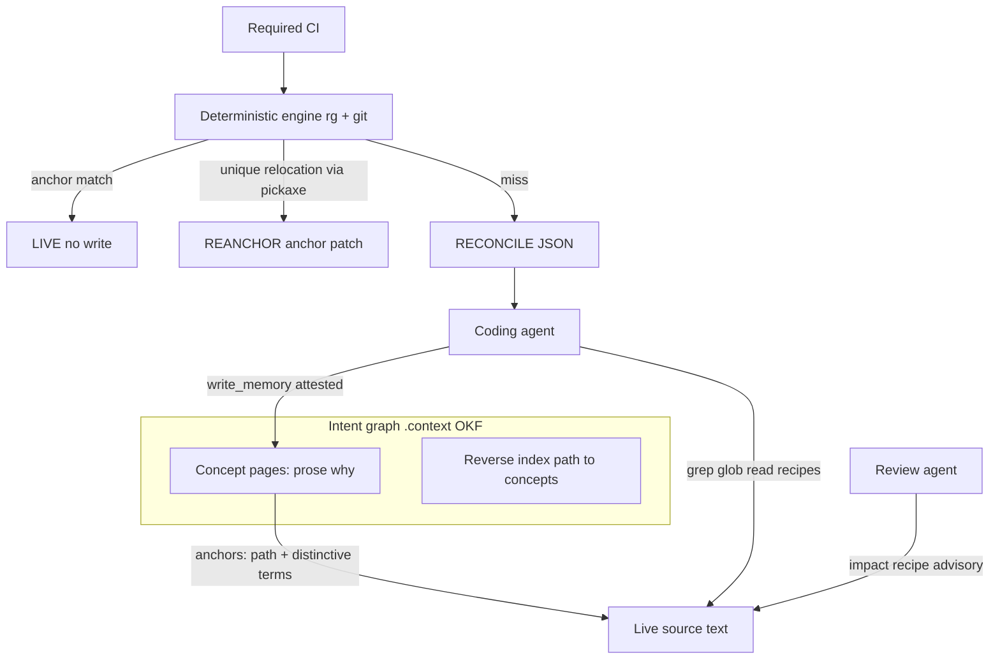
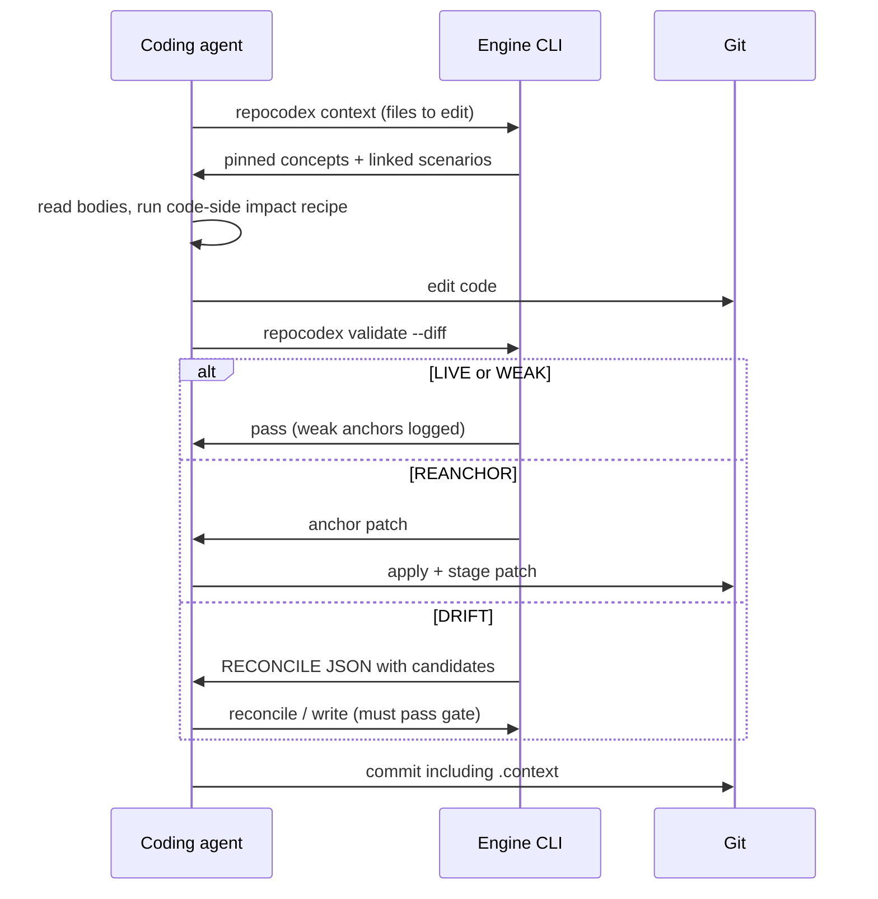

# RepoCodex System Design and Architecture

**Status:** Revision 2.1 — canonical spec (supersedes the 24 Aug 2026 revision; see git history)
**Date:** 25 August 2026 (amended 25 August 2026 after V1 implementation review)
**Related:** [architecture-delta.md](architecture-delta.md) (delta of the original PDF draft vs Revision 1; historical)

Revision 2.1 amends Revision 2 in place after a review of the V1 implementation found two contradictions inside this document. §5.3 promised that a declared `claims` literal changing from `3` to `1` "breaks the match" while §6.2 classified all partial term loss as non-blocking WEAK; the liveness rule now names `CLAIM_BROKEN` as a separate class (§6.2). §11.3 stated a closed set of required-check failures that omitted the CONTRADICTION blocking §13.3 and §15 require; the set is now enumerated once and includes it. §15 and §18 also state explicitly what was previously implicit about determinism inputs and regex dialect portability. Nothing else in Revision 2 changed. See `openspec/changes/fix-repocodex-v1-review-gaps/`.

RepoCodex is an open-source, repository-native **executable memory** framework for autonomous coding agents and code-review agents. It stores _why code exists_ next to the code, proves each record is about live text with a deterministic attester, and serves scoped context and impact to agents through skills, a CLI, and an optional MCP wrapper.

Revision 2 replaces the AST/SCIP linking layer of Revision 1 with **textual anchors attested by ripgrep** plus **agentic retrieval and impact**. The change follows from a decomposition of what the AST layer actually did (three jobs: retrieval, impact, liveness) and the finding that only liveness needs determinism — and determinism does not need syntax trees. Every design break identified in self-validation of this approach is solved **in V1**. Nothing in this document is deferred to a later version.

---

## 1. Executive summary

Modern coding agents write syntax well and forget institutional context. Repositories have instruction files (`AGENTS.md`, `CLAUDE.md`, `.cursor/rules`) and code-search indexes. They do not have a git-native, code-anchored memory that agents write as they work, that later agents can query for blast radius, and that cannot silently detach from the code it describes.

RepoCodex is one stored graph, one link discipline, and one convention for reading code:

- **Intent graph (the only stored layer):** Google Open Knowledge Format (OKF) v0.2 bundle in `.context/`. One concept per file. The markdown **body is the payload**: the prose why of a decision, invariant, or business workflow. Frontmatter carries machine-checkable metadata.
- **Anchors — the link to code:** every concept pins one or more code locations with a set of **distinctive textual terms**. A concept cannot be written unless its anchors match, and drift is detected deterministically by ripgrep — no LLM, no API key, no parser toolchain, same answer in IDE and CI.
- **Agentic code understanding (nothing persisted):** there is no code graph. The code side is the live source text itself; coding agents understand it the way they already do — grep, glob, iterative reads — guided by skill recipes and a committed reverse index (`path → concepts`). Impact analysis is an agent recipe over those primitives, advisory by design.

**Audience:** autonomous coding agents first; code-review agents on the same interfaces. Developers are not in the hot path, but V1 ships an explicit human escape hatch because production repos have hotfixes and human PRs.

**Positioning:** git-native memory that agents write, attest, and query — not a code-search engine, not another `AGENTS.md` (the deterministic liveness guarantee is the difference), not a static-analysis replacement.



---

## 2. Goals and non-goals

### Goals

- Persist _why_ next to _what_, in git, so it branches, merges, and rolls back with the code.
- Let the agent that writes the code also write the memory, in the same change.
- Prove every memory record is about live code text (mandatory anchors + write-gate tightness), for **any grep-able file** — source, config, SQL, IaC, docs.
- Answer "what code and which business scenarios does this diff touch?" through an agent recipe over grep/read plus the intent graph — with the deterministic parts enforced and the judgment parts advisory. Scenario integrity is that same loop: the agent retrieves the linked why and reads the pinned code. It is not a test suite and not a scenario-to-test table.
- Keep retrieval token-cheap (reverse index + staged reads; never dump `.context/`).
- Make mechanical memory maintenance unskippable (engine + hook + required CI), while keeping the required CI check strictly deterministic.
- Give humans a governed escape hatch instead of pretending they never touch the repo.

### Non-goals

- Human authoring or per-record human approval as a load-bearing step.
- Replacing Semgrep, ESLint, import-linter, ArchUnit, CodeQL, or other enforcement tools. (RepoCodex _pins its memory to their configs_ — see §13.3 — it does not reimplement them.)
- A persisted code graph, AST witnesses, Tree-sitter, SCIP, or ast-grep. These were evaluated and **removed by design, not postponed**: the witness-authoring ergonomics failed self-validation (the Revision 1 spec's own example rules did not match the code they described), and the code-graph precision they promised was, in practice, name-based heuristics — which agents replicate with grep plus judgment.
- Using an LLM as the liveness attester (an LLM asked "is this memory still valid?" will say yes so the task can proceed).
- Using a test suite or a scenario-to-test table as the product's check that existing scenarios still hold. Why lives in OKF; agents retrieve it and read the pinned code.

---

## 3. Audience and social contract

| Actor                | Role                                                                                                                                                                                                                                                                   |
| -------------------- | ---------------------------------------------------------------------------------------------------------------------------------------------------------------------------------------------------------------------------------------------------------------------- |
| Coding agent         | Primary writer and reader. Runs the context recipe before editing, accepts RECONCILE, writes or repairs memory in the same change.                                                                                                                                     |
| Review agent         | Consumer of the same interfaces. Runs the impact recipe on every PR; verifies new concepts' prose against the diff while the diff is in context; flags weakenings, contradictions, skipped memory. Findings are a **separate advisory check**, never the required one. |
| Deterministic engine | Thin CLI over ripgrep + git. Attests anchors, rejects loose writes, relocates unique moves, emits RECONCILE JSON. Never asks a human, never calls a model.                                                                                                             |
| CI                   | Required check runs **only the deterministic engine**. Fails on the closed set enumerated in §11.3 — unreconciled drift, broken claims, ratcheted skipped memory, index desync, unresolved contradiction. Survives `git commit --no-verify`.                           |
| Human developer      | Not in the hot path, but first-class at the edges: a governed `memory-exempt` override for hotfixes (§12.3) and `repocodex repair` as a one-command repair flow.                                                                                                       |

Memory mutations are normal. When intent changes, the agent updates the concept in the same change. CI does **not** fail because memory was updated. It fails because an anchor broke and was not healed or repaired.

---

## 4. The intent graph and its link to code

### 4.1 Intent graph (unchanged in substance)

OKF v0.2 bundle at `.context/`. One concept per file. Identity is the path relative to `.context/` (OKF). Markdown links between related concepts form the cross-package graph. Git is the source of truth.

The **markdown body is the product**: the narrative why — what the business scenario is, why the code has this shape, what was tried and rejected, what must not break. Frontmatter exists so that prose can be _trusted_: it proves where the why applies and that it is still about live code. Each half covers the other's weakness.

Reserved OKF files at any directory level: `index.md` (page catalog for progressive disclosure), `log.md` (chronological engine/agent updates; the audit trail).

`.context/` mirrors the source tree: package-local concepts live in the package's area; cross-cutting pages (`workflows/`, `decisions/`) live at the root and link downward (§13).

### 4.2 Anchors — the only link between intent and code

An anchor is a claim that a set of distinctive terms co-occurs at a pinned location:

```yaml
verification:
  engine: ripgrep # required engine in V1; field is extensible by design
  anchors:
    - path: src/billing/PaymentGateway.ts
      all_of: ["ENTERPRISE", "grace", "= 3"]
      near: "capturePayment" # optional: all_of must hit within `scope_lines` of this term
      scope_lines: 40 # optional, default 40 when `near` is present
      min_match: 2 # optional N-of-M liveness threshold (default: all terms)
```

Rules of the format:

- `all_of` entries are fixed strings or ripgrep regexes. Terms are matched as tokens, **not** as an exact source line, so formatters cannot break an anchor.
- `near` + `scope_lines` express weak structure ("`yield` within 40 lines of `def iter_batches`") in pure text. This is the V1 answer to structural claims; it is deliberately weaker than AST and honestly labeled as such (§17).
- `min_match` (N-of-M) makes single-term renames degrade a match instead of breaking it: LIVE requires ≥ `min_match` hits, DRIFT requires a full miss, anything between is reported as `WEAK` in validate output and queued for opportunistic tightening. Default is all-of.
- Multiple anchors per concept are first-class; each attests independently (workflows, §13.1).

There is **no stored term database and no code index**. Terms live only in the frontmatter of the concept they belong to; distinctiveness is _checked_ at write time with live `rg` counts, never persisted. Storage scales with the number of whys (thousands), not the size of the codebase.

### 4.3 The reverse index

`.repocodex/reverse-index.md` is a **generated, committed, deterministic** artifact mapping `source path → concept paths`, refreshed by the CLI whenever anchors change (the engine regenerates it as part of any accepted write or reanchor; CI verifies it is in sync). It lives **outside** `.context/` because it is not an OKF concept and `reverse-index.md` is not an OKF reserved name. In sharded monorepos, each mirrored `.context/` directory has a corresponding file under `.repocodex/reverse-index/` and CI attests per affected package.

### 4.4 What replaced the code graph

Nothing is persisted. Revision 1 stacked two stored layers — a code graph ("Layer 1", Tree-sitter/SCIP in a sqlite cache) beneath the intent graph ("Layer 2") — and connected them with virtual edges. Revision 2 keeps only the intent graph, so the layer numbering is retired. The three jobs the old code graph performed are reassigned:

| Job                   | Revision 1 (AST/SCIP)                             | Revision 2                                                                       |
| --------------------- | ------------------------------------------------- | -------------------------------------------------------------------------------- |
| Retrieval routing     | Virtual edges in sqlite                           | Reverse index lookup + staged reads (§7). Deterministic.                         |
| Impact / blast radius | SCIP when fresh (rare), name heuristics otherwise | Agent recipe: grep changed symbols, read hits, walk intent links (§8). Advisory. |
| Liveness / drift      | ast-grep witness                                  | ripgrep anchor attest + git pickaxe relocation (§6). Deterministic.              |

Note that the intent-side half of the old impact walk (concept → linked scenarios → other pinned code) never needed AST: it is markdown links and frontmatter paths, and it survives fully deterministic.

---

## 5. Memory store (OKF v0.2)

`.context/` **is** an OKF v0.2 knowledge bundle: reserved names are only `index.md` and `log.md`; the root index declares `okf_version: "0.2"`; every other `.md` file is a concept with `type`. `verification.anchors` and `claims` are **producer extensions** on the same why document — not a sibling `type: Attested Computation`. `verified` records definition review against `sources`; it is **not** a gate receipt and is never stamped by a successful ripgrep attest, write, or REANCHOR.

### 5.1 Bundle layout

```
.context/
  index.md          # frontmatter: okf_version: "0.2" only
  log.md            # ## YYYY-MM-DD headings, newest first
  workflows/
    index.md        # no frontmatter; title — description links
    checkout-capture.md
  decisions/
    index.md
    custom-data-streamer.md
    layering-no-domain-to-infra.md
  invariants/
    index.md
    enterprise-grace-period.md
  services/
    billing/
      index.md
      idempotency-key.md
```

The reverse index is written beside metrics: `.repocodex/reverse-index.md` (shards: `.repocodex/reverse-index/<escaped-context-root>.md`).

Identity is the path relative to `.context/` with `.md` removed (OKF). An optional `contract_id` may exist for display; it is not identity.

### 5.2 Frontmatter contract

OKF-required: `type`. OKF v0.2 families used as specified upstream: `title`, `description`, `tags`, `generated`, `verified`, `status` (`draft` | `stable` | `deprecated`; omitted `status` means `stable`), `stale_after`, `sources` (list of objects with `resource`).

`verified` is optional definition review (`{ by, at }` or a list of stamps). Actors are `<producer>/<version>`, `human:<id>`, or `process:<id>` — never `agent:`. A passing pin check does **not** write `verified`.

RepoCodex extensions (OKF allows unknown keys; consumers must preserve them):

| Field          | Required                                          | Meaning                                                                                                                                                                                                                                                                                                                                                                                                                                                                                                                                                                                                         |
| -------------- | ------------------------------------------------- | --------------------------------------------------------------------------------------------------------------------------------------------------------------------------------------------------------------------------------------------------------------------------------------------------------------------------------------------------------------------------------------------------------------------------------------------------------------------------------------------------------------------------------------------------------------------------------------------------------------- |
| `verification` | on concepts that pin code                         | Engine + anchors (§4.2). Absent on unanchored knowledge pages (Playbooks, etc.).                                                                                                                                                                                                                                                                                                                                                                                                                                                                                                                                |
| `claims`       | on any concept whose prose states checkable facts | **Structured claim list**: `claims: [{ literal: "3", subject: "grace_cycles", anchor: 0 }, { literal: "ENTERPRISE" }]`. Each declared literal must appear in the **owning** anchor's terms and in that anchor's matched source — checked at write time by the gate (§6.1) **and on every validation** as `CLAIM_BROKEN` (§6.2). The optional `anchor` index names which entry in `verification.anchors` owns the literal; omit it only when the owner is unambiguous. The optional `subject` discriminator names what the literal is a value of, so contradiction detection can compare like with like (§13.3). |
| `supersedes`   | on why-change                                     | Path of the deprecated predecessor                                                                                                                                                                                                                                                                                                                                                                                                                                                                                                                                                                              |
| `rationale`    | on mutation                                       | Why the why changed                                                                                                                                                                                                                                                                                                                                                                                                                                                                                                                                                                                             |
| `okf_version`  | yes (bundle-level, only key in root `index.md`)   | OKF bundle version (`"0.2"`). Engine version lives in `.repocodex.toml` / CLI envelope.                                                                                                                                                                                                                                                                                                                                                                                                                                                                                                                         |

`status: draft` is only for bootstrap records that have not yet been promoted. Production reads default to `stable`. Bootstrap-mined concepts **must** carry `sources` with `resource` (§14.2).

### 5.3 Concept types

- **TechnicalDecision** — narrative why bound to code. Must anchor at least one distinctive construct from the why (the term `yield`, an error string), not just a name.
- **InvariantContract** — a must-still-hold claim. Declared `claims` literals are frozen into anchors and re-checked on every validation as `CLAIM_BROKEN` when absent from the matched region (§6.2), so changing `3 → 1` is a blocking business-rule change rather than a WEAK term-count miss. Each claim names the anchor that owns it via an optional `anchor` index into `verification.anchors` (alongside `literal` and `subject`); omitted owners resolve to the sole anchor, or to the single anchor whose `all_of` declares the literal, and are rejected when ambiguous. The claim is evaluated against that owning anchor alone.
- **BusinessWorkflow** — a cross-package flow with one anchor per participating site (§13.1). Kept thin: ordering, boundaries, links to per-step pages. A claim on a workflow is owned by one of those sites, not required to hold at every site.
- **GuardrailDecision** — the why behind a negative/global architectural rule, anchored to the **enforcement config** of the tool that enforces it (§13.3).

All pinning types require passing anchors at write time. Unanchored pages (unknown or narrative `type` values without `verification`) are valid OKF concepts: they load, retrieve via links, and do not enter the reverse index or arm skipped-memory.

### 5.4 Example: Invariant Contract

```markdown
---
type: InvariantContract
title: Enterprise accounts get a 3-cycle grace period
tags: [billing, enterprise]
generated: { by: claude-code/opus, at: 2026-08-25T12:10:00Z }
status: stable
sources:
  - resource: git://commit/abc123
    title: commit
claims:
  - literal: "3"
    subject: grace_cycles
  - literal: "ENTERPRISE"
    subject: plan_tier
verification:
  engine: ripgrep
  anchors:
    - path: src/billing/PaymentGateway.ts
      all_of: ["ENTERPRISE", "grace", "= 3"]
      near: "capturePayment"
---

Enterprise customers were churning when a single failed payment suspended
their account mid-quarter. Sales committed to a three-billing-cycle grace
window in enterprise contracts (2025 renewal terms), so suspension logic
must not run until the fourth consecutive failure. Changing the window is
a business-rule change: supersede this concept, do not silently edit the
code. Related: [dunning email schedule](./dunning-schedule.md).
```

### 5.5 Example: Technical Decision

```markdown
---
type: TechnicalDecision
title: Custom data streamer must not become a list comprehension
description: Generators leaked the unparsed XML tree during batch ingestion.
tags: [ingestion, memory]
generated: { by: cursor/grok-4.6, at: 2026-08-25T12:00:00Z }
status: stable
verification:
  engine: ripgrep
  anchors:
    - path: src/core/streams/CustomDataStreamer.py
      all_of: ["yield", "iter_batches"]
      near: "def iter_batches"
      scope_lines: 40
---

Do not optimize `iter_batches` into a list comprehension. Standard generators
held references to the unparsed XML tree and leaked memory during batch
ingestion (incident 2025-11, see sources).
```

An anchor of `["iter_batches"]` alone is tautological (the name existing proves nothing about the why) and the write gate rejects it.

---

## 6. Write gate, liveness, and change classes

### 6.1 Write-gate tightness — `repocodex write` (deterministic, rg-count based)

The agent drafts anchors; the engine accepts or rejects with JSON. Fail closed. All checks are ripgrep counts — milliseconds, no model:

1. **Match.** Every anchor's terms must hit its pinned path (within `near`/`scope_lines` when present). Zero hits → reject.
2. **In-file uniqueness.** The term combination must locate a unique region in the pinned file. Multiple disjoint co-occurrence regions → reject (`ambiguous_in_file`), unless the concept declares multiple anchors covering them.
3. **Distinctiveness.** Each anchor must include at least one term whose repo-wide hit count is below a configurable ceiling. Path-only anchors, single common-word terms, and import-line terms are rejected (`not_distinctive`). The gate reports each term's repo-wide count so the agent can choose better terms mechanically. Stable tokens — string literals, error messages, enum values, numeric thresholds — are preferred over renameable identifiers, and the gate ranks candidate terms accordingly in its reject payload.
4. **Claims.** Every `claims[].literal` must appear in the **owning** anchor's terms **and** in that anchor's matched source region. The owner is `claims[].anchor` (an index into `verification.anchors`), or is resolved to the sole anchor / the single `all_of` that declares the literal. "3-cycle grace" prose with no `3` anchored → reject (`claim_not_anchored`).
5. **Exclusions.** Pins inside `.gitignore`d, vendored, or `.repocodexignore`d paths are rejected. Generated files are excluded from candidate search and distinctiveness counting too, so codegen cannot flip anchors ambiguous.

Reject payload example:

```json
{
  "accepted": false,
  "tighten": ["not_distinctive", "claim_not_anchored"],
  "term_counts": { "grace": 412, "ENTERPRISE": 9, "= 3": 3801 },
  "suggestions": [
    "use the enum literal or the user-facing error string as a term"
  ]
}
```

### 6.2 Liveness rule

**Anchor match ⇒ live.** On `repocodex validate` (agent turn, pre-commit hook, or CI), for each stable concept whose pinned paths intersect the diff:

1. Run the anchor terms over the pinned file (`near` scoping applied).
2. **≥ `min_match` terms hit in the pinned region → LIVE.** Formatting, comments, added lines, and unrelated edits inside the region do not page anyone. Nothing is written.
3. Terms hit below `min_match` but above zero → **WEAK**: reported in validate output, never blocking, queued in `log.md` for opportunistic tightening by the next agent that touches the file.
4. **Full miss → relocation search, then classification:**
   - `git diff -M` 1:1 rename of the pinned path, or `git log -S`/pickaxe on the most distinctive term finding **exactly one** new location where the term set co-occurs → **REANCHOR**. The engine emits an anchor patch (updated `path`/terms in the concept's frontmatter); **the caller (agent, hook, or CI job) applies and stages it** — the engine never mutates the working tree itself, which keeps a single writer and avoids racing staged hunks and other hooks.
   - Zero or multiple relocation candidates → **DRIFT**: RECONCILE JSON with `candidates[]` (from the pickaxe/grep search) and impacted scenario list. The coding agent repairs; the new state must pass the write gate.

**Claims are evaluated separately, and this is not optional.** Steps 1–4 answer _is this concept still about this code?_ — a deliberately forgiving question, which is why partial term loss degrades to WEAK instead of paging anyone. A declared `claims[].literal` answers a different question: _is the specific fact this prose asserts still true in the code?_ That one is binary, and forgiveness is the bug. So for every stable concept carrying `claims`, each declared literal is checked as a token against **its owning anchor's** matched region, **independently of the term-count class above**:

5. Every declared literal present in the matched region → no claim finding. The anchor's own class from steps 2–4 stands unmodified.
6. Any declared literal absent from the matched region → **CLAIM_BROKEN**, reported _alongside_ the anchor class, blocking outside `shadow`, repairable only through a gate-passing write (normally a supersede with `rationale`).

An anchor can be perfectly LIVE while its claim is broken — `ENTERPRISE` and `grace` still co-occur after `= 3` becomes `= 1`. That combination _is_ the silent business-rule change of §5.4, so it has to be nameable. Earlier revisions of this document folded the claim check into the term count, which made §5.3's promise ("changing `3 → 1` breaks the match") false in practice: two of three terms still hit, the concept classified WEAK, and WEAK never blocks.

Collapsing claims into `min_match` instead — forcing all-of whenever claims are present — was considered and rejected: it would make an unrelated identifier rename in a claims-bearing concept hard-DRIFT, reintroducing exactly the rename storm `min_match` exists to prevent (§17 row 2).

| Class        | Detection                                       | Engine action                                             | Agent paged? | Tree write?                   |
| ------------ | ----------------------------------------------- | --------------------------------------------------------- | ------------ | ----------------------------- |
| LIVE         | ≥ min_match terms in pinned region              | None — report only                                        | No           | No                            |
| WEAK         | Partial term loss                               | Log + queue                                               | No           | No                            |
| REANCHOR     | Unique relocation (rename or pickaxe)           | Emit patch; caller applies                                | No           | Yes — anchors only, by caller |
| DRIFT        | Full miss, 0 or >1 candidates                   | RECONCILE JSON                                            | Yes          | Only after attested repair    |
| CLAIM_BROKEN | Declared literal absent from the matched region | Report with the lost literal; orthogonal to the row above | Yes          | Only after attested repair    |

### 6.3 Uniqueness scope (defined, not implied)

Attest-time uniqueness is evaluated **within the claimed pinned files only**. Repo-wide search runs solely as a relocation locator after a full miss. If new code elsewhere makes an anchor's terms less distinctive, that is recorded as a **warning attached to the PR that introduced the duplicate** — it never drifts a concept whose own pins were untouched. No innocent-bystander pages.

### 6.4 Optional in-code markers

Teams may additionally place `// why: .context/invariants/enterprise-grace-period.md` comments at pinned sites. A marker counts as one anchor term and CI verifies marker ↔ concept agreement by grep. Markers are **never the sole anchor**: comments get deleted and drift from the code below them, so making them load-bearing would recreate the detachment problem.

---

## 7. Retrieval: staged and token-cheap

Never dump `.context/` into a prompt.

1. **Reverse index** (`.repocodex/reverse-index.md`): one read answers "which concepts pin the files I am about to edit."
2. **`index.md` catalogs**: titles, types, tags per directory for progressive disclosure.
3. **Bodies on demand**: the agent reads full prose only for the (typically 2–5) concepts pinned to the code in play, plus 1 link-hop of related pages as titles.
4. **Ranking**: provenance-weighted (attested + `sources`-cited concepts before bare narrative; high-churn concepts down-ranked, inferred from git history, never stored as a score).

This is a skill recipe over file reads — no server required. The optional MCP wrapper (§9) exposes the same staging as `get_context` / `read_concept` for harnesses that prefer tools.

---

## 8. Impact: an agent recipe with a determinism split

Blast radius has two halves with different natures, and V1 treats them differently:

- **Intent-side (deterministic):** changed files → reverse index → concepts → OKF links → other pinned paths. Pure file reads. The engine computes this and includes `impacted_scenarios` in every validate output.
- **Code-side (judgment):** grep changed symbol names repo-wide, rank hits by path proximity and test-file status, read the plausible callers, filter with judgment. This is what coding agents already do; the skill makes it a required step of the loop and bounds it: caps on files read per walk, hit-ranking before reading, excluded paths respected.

**Enforcement split (a V1 rule, not a preference):** the code-side walk is nondeterministic — two runs can surface different caller sets — so its findings post to the **advisory review check only**. The required CI check contains nothing an agent judged. This is what keeps the required check reproducible and therefore alive (§12).

Both coding and review skills must run the impact recipe on every diff. Missed impact is a skipped recipe step, and the review agent flags it.

That read of retrieved why plus pinned code is how an agent checks that an existing scenario still holds. The recipes do not invoke a test runner, and a test-suite result is not a substitute for the retrieved concepts. Scenario-integrity judgment belongs on the advisory check; the required check only attests that the why is still pinned.

---

## 9. Interfaces: CLI, skills, MCP

The **CLI is canonical**; everything else wraps it.

| Command                         | Caller              | Behavior                                                                                                                                                                                                                                                   |
| ------------------------------- | ------------------- | ---------------------------------------------------------------------------------------------------------------------------------------------------------------------------------------------------------------------------------------------------------- |
| `repocodex validate --diff`     | hook, CI, agents    | Attest anchors on the diff. `LIVE` / `WEAK` / `REANCHOR` (patch emitted) / `RECONCILE` JSON + `impacted_scenarios`, plus any `CLAIM_BROKEN` findings. Read-only: emits patches, metrics, and audit entries in the verdict; never writes to the tree (§15). |
| `repocodex write <concept>`     | coding agent        | Write gate (§6.1). Accept or reject with counts and suggestions. Regenerates reverse index on accept.                                                                                                                                                      |
| `repocodex reconcile <concept>` | coding/review agent | Repair DRIFT with new anchors; must pass the gate.                                                                                                                                                                                                         |
| `repocodex context <paths>`     | agents              | Reverse-index lookup + staged catalog (machine-readable).                                                                                                                                                                                                  |
| `repocodex repair`              | **humans**          | One command: invokes a repair agent on the current RECONCILE state. A human's repair action is "run one command," not "author anchors."                                                                                                                    |
| `repocodex install`             | setup               | Pre-commit hook + GitHub Action + skills. Optional MCP registration is `repocodex install --mcp` when the `mcp` extra is importable.                                                                                                                       |
| `repocodex bootstrap`           | setup               | Mine git history/comments/docs; keep only gate-passing concepts; `status: draft`, short `stale_after`, `sources` required.                                                                                                                                 |
| `repocodex audit`               | scheduled job       | Sampling truth audit (§14.2) and distinctiveness re-scoring (§16).                                                                                                                                                                                         |

**Skills** (coding + review) carry the recipes: context before edit, impact on diff, reconcile handling, anchor-authoring guidance with the stable-token preference. **MCP server** (optional) exposes `get_context`, `get_impact`, `read_concept`, `write_memory`, `validate_diff`, `reconcile_memory` as thin wrappers over the CLI for tool-native harnesses. Distribution is an Agent Plugins 1.0 package (skills + `mcp.json`); hooks remain per-client adapters plus the portable git pre-commit floor — Agent Plugins 1.0 does not carry hooks.

Validate outcome example:

```json
{
  "result": "RECONCILE",
  "lost": [
    {
      "concept": "decisions/custom-data-streamer",
      "anchor": 0,
      "reason": "full_miss"
    }
  ],
  "weak": [],
  "claim_broken": [
    {
      "concept": "invariants/enterprise-grace-period",
      "anchor": 0,
      "literal": "3",
      "anchor_class": "LIVE"
    }
  ],
  "candidates": [
    { "path": "src/core/streams/streamer_v2.py", "via": "pickaxe:iter_batches" }
  ],
  "impacted_scenarios": [
    "decisions/custom-data-streamer",
    "workflows/batch-ingestion"
  ],
  "blocking_reasons": ["drift", "claim_broken"],
  "engine_version": "0.0.1"
}
```

---

## 10. Engine vs LLM

| Path                                                                                                            | Technology                    | Allowed to decide?                                                                           |
| --------------------------------------------------------------------------------------------------------------- | ----------------------------- | -------------------------------------------------------------------------------------------- |
| Anchor attest; uniqueness/distinctiveness counts; claims check; relocation; reverse index; required CI verdicts | ripgrep, git, thin Python CLI | Yes. Deterministic. No API key.                                                              |
| Draft why, choose anchor terms, code-side impact walk, DRIFT repair proposals, review commentary, truth audits  | Agent skills; models          | No. Proposal and advice only. The gate and attester decide; advisory findings stay advisory. |

The liveness question is never delegated to a model. An LLM asked "is this still the same rule?" will often say yes so the task can proceed; this failure mode is why the deterministic attester exists and why removing AST did **not** remove determinism.

---

## 11. End-to-end workflows

### 11.1 Coding agent (primary)



Stop/commit is denied until validate passes. A LIVE pass requires no `.context/` hunk **for edits that stay inside the region the anchor attests**. New behavior added outside every matched region of a covered file still arms the skipped-memory ratchet — a live anchor proves the pinned region's memory is intact and says nothing about code added elsewhere in the file.

### 11.2 Review agent

- Runs the impact recipe on the PR diff (code-side + intent-side).
- **Verifies new concepts' prose against the diff** while the diff is still in context — the one moment narrative truth is cheaply checkable (§14.2).
- Flags: unreconciled DRIFT, skipped recipe steps, why-change without `supersedes`/`rationale`, weakenings, CONTRADICTION, high churn, workflow pages whose multi-package pins were touched without the page being considered.
- Posts to a **separate advisory check**. It is a second machine, not a stand-in developer, and it never gates merges by itself.

### 11.3 CI (required check — deterministic only)

A stateless action runs the headless engine on the PR diff. The set of failure reasons is **closed and enumerated here**; adding to it is a spec change, not an implementation detail. The check fails when, and only when:

1. any stable anchor is DRIFT and unrepaired — i.e., unreconciled detachment;
2. any stable concept is **CLAIM_BROKEN**: a declared literal is gone from the matched region (§6.2);
3. the **skipped-memory ratchet** fires: the diff introduces substantive change to a file that already carries at least one attested concept, and the obligation is not discharged. Discharge requires that a concept _pinning that file_ was added or modified in the same change, or that every substantive hunk falls inside a matched region of an attesting anchor that pins it. An attesting (LIVE) anchor does not by itself discharge the whole file. Correspondence is per-file — an edit elsewhere under `.context/` does not discharge an unrelated file's obligation. Ratchet scope applies only to already-covered files (brownfield-safe, §12.2);
4. the committed reverse index is out of sync with anchors;
5. an unresolved **CONTRADICTION** exists: two live concepts assert different literals for the same claim subject, or two live concepts supersede the same predecessor (§13.3, §15). This is a frontmatter comparison — deterministic, no model — and an unresolved one leaves the graph genuinely ambiguous about which why is current.

Every entry must be reproducible from repository contents alone. Never fails because `.context/` changed, because a WEAK anchor degraded, because of a dilution warning, or because of any agent-judged finding. Branch protection must mark this check required; without that, "never skip" is false.

Entry 2 is new in Revision 2.1. Entry 5 previously appeared only in §13.3 and §15 while this section listed four failure reasons and disclaimed the rest, so an implementation could satisfy either passage and violate the other. The enumeration above is now the single source.

---

## 12. Unskippable memory — and the governed exceptions

### 12.1 The loop

A skill that says "please write memory" will be skipped. MCP cannot force a call. `git commit --no-verify` exists. Therefore `repocodex install` ships all of: engine re-attest on every validate/pre-commit; stop/commit deny on DRIFT (hook filters `git commit` inside the hook body); the required deterministic CI check; and the advisory review agent. There is no design in which any single mechanism suffices.

### 12.2 Brownfield rollout — part of V1, as postures not versions

A required check that blocks all work in a repo with zero coverage gets its requirement removed within a week, taking the whole guarantee with it. V1 therefore ships three **rollout postures** of the same complete product (nothing is a future version; posture is a config flag):

| Posture   | Behavior                                                                                                                                                                                                                                                                                                                                                                                                                                                                                                                                                                        |
| --------- | ------------------------------------------------------------------------------------------------------------------------------------------------------------------------------------------------------------------------------------------------------------------------------------------------------------------------------------------------------------------------------------------------------------------------------------------------------------------------------------------------------------------------------------------------------------------------------- |
| `shadow`  | Everything runs and reports; nothing blocks. **Reporting means computing** — every finding the posture declines to block on (skipped memory, claim breakage, drift, contradiction, index desync) is still evaluated, because the metrics that decide readiness are derived from them. Suppressing a computation here is not "shadow," it is blindness: false-drift rate, anchor-rejection reasons, reconcile retries, tokens per turn, and validate latency must carry measured values, not placeholders, or the ladder cannot be climbed on evidence.                          |
| `ratchet` | DRIFT, CLAIM_BROKEN, and pre-commit deny enforced (they only fire on already-covered code). Skipped-memory applies only to covered files, and per file: the obligation is discharged when a concept _pinning that file_ is added or modified, or when every substantive hunk falls inside a matched region of an attesting anchor. A LIVE classification alone does not discharge the whole file. Only substantive change arms it; whitespace and comment-only edits do not. Working-tree scope compares against `HEAD` so staging does not hide the change. Escape hatch live. |
| `full`    | Ratchet plus: skipped-memory extends to agent-authored commits repo-wide (detectable from `generated.by` and harness identity), sampling audits scheduled.                                                                                                                                                                                                                                                                                                                                                                                                                      |

`repocodex bootstrap` seeds attested coverage before the ratchet tightens.

### 12.3 Human escape hatch

A `memory-exempt` PR label (or equivalent override) lets a human merge past the required check when the situation demands it — hotfixes, incident response. Using it: requires review-agent acknowledgment on the PR, writes an audit entry to `log.md`, and files a follow-up repair task that the next agent session on the repo picks up.

Acknowledgment must be **verifiable evidence** — an acknowledgment recorded on the PR and checked from the CI context, or a committed acknowledgment record — never an unauthenticated flag the caller passes to the engine, which would make the governed hatch a self-service one. The engine does not decide here either; it checks that evidence a human and a review agent produced exists. Per the single-writer rule (§15) it _emits_ the `log.md` entry and the follow-up task in the verdict rather than writing them mid-verdict, and the caller persists them. The override path must be wired end to end in the shipped CI workflow: a hatch that cannot actually clear the check is the same as no hatch, and it pushes people toward removing branch protection instead. `repocodex repair` gives humans a one-command way to avoid needing the exemption at all. The design does not pretend humans never commit; it makes their bypass visible and self-healing instead of forcing them to remove branch protection.

---

## 13. Cross-package workflows and architectural decisions

### 13.1 Business workflows: one thin page, many anchors

A flow spanning packages is one `BusinessWorkflow` concept with an anchor per participating site. Editing any one site retrieves the whole story through the reverse index; each anchor attests independently, so one team's rename costs a one-anchor reanchor, not a page rewrite. Workflow pages are kept **thin** — ordering, boundaries, links to per-step invariants — because they are the highest-churn concept type; detail lives in package-local pages.

### 13.2 Cross-concept cohesion

OKF markdown links are the cross-package graph. The intent-side impact walk (§8) follows them deterministically: a diff in `billing` surfaces the checkout workflow page, which pins `ledger` and `notify` — the agent sees the downstream ordering constraint before committing.

### 13.3 Negative/global architectural rules: pin the guardrail

Anchors prove presence, not absence; no witness scheme can prove "no file does X." Enforcement of negative rules ("domain never imports infrastructure") belongs to import-linter/Semgrep/ArchUnit in CI — and their rule files are grep-able text, which this design can anchor. Pattern:

- The **rule** is enforced by the dedicated tool.
- The **why** is a `GuardrailDecision` concept anchored to that tool's config (`path: .importlinter, all_of: ["domain", "infrastructure", "forbidden"]`).

If anyone weakens or deletes the guardrail, the anchor drifts and the agent doing it is paged with the rationale before the rule silently disappears — the exact failure mode such rules die from.

**CONTRADICTION requires an actual conflict.** Two concepts pinning the same file with _different_ claims is the ordinary case, not a conflict — a grace-period invariant and a retry-budget invariant legitimately coexist in one payment gateway, and flagging that pair would put a false blocking finding on the required check, which is how required checks get unrequired (§17 row 11). A conflict needs a shared **subject**, not merely a shared file: two live concepts asserting different literals for the same claim `subject` (§5.2), or two live concepts superseding the same predecessor. Absent a subject discriminator, the comparison defaults to no conflict — silence beats a false page. When a genuine contradiction is raised the current agent must supersede one; the engine never picks a winner.

---

## 14. Self-serving mutation, poisoning, and garbage

### 14.1 Containment of weakening (unchanged in substance)

New state must pass the gate; why-changes `supersede` (never clobber) and require `rationale`; high-churn concepts are down-ranked in retrieval; the review agent flags weakenings; CONTRADICTION forces explicit resolution. The gate's structured `claims` field closes the Revision 1 loophole where agents could dodge literal-freezing by vaguer prose: claims are declared data, not mined text.

### 14.2 Attested-but-wrong memory (treated as a first-class threat)

An anchor proves anchoring, not truth — and wrong institutional memory is worse than none, because agents obey it. V1 ships three countermeasures, none deferred:

1. **Write-time truth check:** the review agent verifies a new concept's prose against the originating diff while both are in context. This is the only cheap moment to check truth; the skill makes it mandatory for every new concept in a PR.
2. **Provenance-weighted retrieval:** concepts citing `sources` (commit, PR, incident) rank above bare narrative; bootstrap-mined concepts require `sources` and expire via `stale_after` unless re-attested.
3. **Sampling audits:** `repocodex audit` periodically hands N random stable concepts plus their pinned code regions to a model for contradiction screening. Findings become CONTRADICTION flags for an agent to resolve — the audit proposes, the normal attested-write path disposes. Audit runs are scheduled jobs, never in the hot path or the required check.

### 14.3 Volume

One concept per why, not per edit; update in place when the why is unchanged. `stale_after` on bootstrap/low-confidence records. GC deprecates (never deletes; git keeps history) unmatched drafts, expired records, and orphaned pages — no inbound OKF links and no live anchors. (Retrieval-count GC from Revision 1 is dropped: without a long-lived server there is no retrieval telemetry, and link/anchor orphanhood is checkable from the files alone.) Scoped retrieval keeps a ten-year corpus out of the prompt.

---

## 15. Merges, concurrency, and determinism across environments

- **Single-writer rule:** the engine emits patches; callers apply them. No mid-hook tree mutation, no racing staged hunks. This binds **all** of validate's outputs, not just anchor patches: metrics, `log.md` audit entries, and follow-up repair tasks are emitted in the verdict for the caller to persist. Validation is read-only — a clean tree stays clean across any verdict in any posture. Any metrics sink lives outside the committed `.context/` bundle and is git-ignored; telemetry is not memory.
- **Determinism inputs (stated, not implied):** a verdict may depend only on **tracked, non-excluded repository contents** plus the **explicitly requested diff scope**. Untracked files, ignored files, and excluded paths influence nothing — not a classification, not a derived threshold such as the distinctiveness ceiling, not a generated identity. Derived thresholds count tracked files via git rather than walking the filesystem, generated identities come from a stable content digest rather than a process-seeded hash, and relocation searches inherit the caller's diff scope so the hook, the local CLI, and CI resolve the same rename the same way. Without this rule "same answer in IDE and CI" is an aspiration; with it the property holds by construction.
- **Post-merge re-attest:** the first validate after a merge re-runs anchors for every concept whose pins or anchors changed on either side. Anchors are rebuildable claims, not sacred state; a merge that leaves both sides' `supersedes` targeting the same concept raises CONTRADICTION instead of silently coexisting.
- **One concept per file** remains the merge strategy for `.context/` itself; the reverse index is regenerated, not merged.
- **Version pinning:** `.repocodex.toml` pins the engine version; hook, local CLI, and the CI image resolve exactly that version. With no parser grammars in the stack, drift surface is small (ripgrep semantics are stable), but the pin guarantees "same answer in IDE and CI" by construction, and `engine_version` appears in every validate output.
- **Worktrees:** any local cache is per-worktree and disposable; CI needs no cache at all.

---

## 16. Scale and performance

- **Storage:** anchors live only in concept frontmatter. 5,000 concepts × ~4 terms is a few hundred kilobytes across files git already handles. No term database, no embedding index, no code index.
- **Validate:** scoped to concepts whose pinned paths intersect the diff (one reverse-index read). Tens of file-scoped rg searches per typical PR — milliseconds each. Full-repo attest (nightly) over thousands of concepts is seconds and trivially parallel.
- **Write gate:** a handful of rg counts at write/reconcile time only; never on the read path.
- **Distinctiveness decay:** terms distinctive at write time can dilute as the repo grows. This cannot cause false drift (liveness is in-file, §6.3); it only widens relocation candidate lists. `repocodex audit` re-scores anchor distinctiveness periodically and queues weak anchors for opportunistic tightening — housekeeping, not a treadmill.
- **False-drift rate:** the share of `DRIFT` classifications that a later reanchor showed were followable relocations — drift whose repair re-points the anchor at code equivalent to the pinned region. It is derived over a window of recorded `drift` and `reconcile` metric events at **read time**, not as a per-validation ratio of drift to outcomes. A single validate whose pin was deleted reports `0.0` while still listing the drift in `lost`.
- **Token budget / per-turn cost:** measured from the context actually served to the caller by `repocodex context` (payload characters / 4), and recorded on that command. Validation does not re-run retrieval or per-concept churn inference to compute it. The code-side impact walk remains the other marginal cost; the skill bounds it (hit ranking, read caps, exclusions), and shadow posture measures both before any gate is enforced. No SLO is advertised until measured.
- **Monorepos:** `.context/` shards by directory ownership; per-directory reverse indexes; CI attests affected packages only.

---

## 17. Known design breaks and their V1 solutions

This design was self-validated the same way Revision 1 was. Every break found is solved in V1; the residual risks are named honestly.

| #   | Design break                                                                                                                                                                                      | V1 solution                                                                                                                                                                                                                                                                                            | Residual risk                                                                                                                                                                                             |
| --- | ------------------------------------------------------------------------------------------------------------------------------------------------------------------------------------------------- | ------------------------------------------------------------------------------------------------------------------------------------------------------------------------------------------------------------------------------------------------------------------------------------------------------ | --------------------------------------------------------------------------------------------------------------------------------------------------------------------------------------------------------- |
| 1   | Pure-agentic liveness is self-serving: the validator and the party motivated to proceed are the same model. Memory would rot silently and the system would degenerate into a fancier `AGENTS.md`. | Liveness is never agentic. The deterministic rg attester runs in hook and required CI with no model (§6, §10). Agents only enter on RECONCILE.                                                                                                                                                         | None — this is the load-bearing invariant of the whole design.                                                                                                                                            |
| 2   | Rename-heavy refactors cause drift storms: a grep term breaks where an AST metavariable survived.                                                                                                 | Stable-token preference enforced and ranked by the write gate (string literals, error messages, enums, thresholds over identifiers); N-of-M `min_match` so single-term loss degrades to WEAK instead of DRIFT; deterministic relocation via `git diff -M` + pickaxe before anyone is paged (§6.1–6.2). | Residual false-drift rate is unknown until measured — the shadow posture exists to quantify it before enforcement (§12.2).                                                                                |
| 3   | Agentic impact is nondeterministic and would make the required check flaky, triggering its removal.                                                                                               | Determinism split (§8, §11.3): required CI contains only rg-attest liveness, the file-level ratchet, and index sync. All judgment findings post to the separate advisory review check.                                                                                                                 | Advisory findings can be ignored; the ratchet and DRIFT rules still hold the floor.                                                                                                                       |
| 4   | Token cost moves from a one-time index to every query; monorepo symbol greps can explode.                                                                                                         | Bounded recipe: hit ranking by path proximity and test status, per-walk read caps, exclusion lists; intent-side impact answered deterministically by the reverse index at zero inference cost; tokens-per-turn instrumented in shadow posture (§8, §16).                                               | If a specific repo's measured cost is unacceptable, that repo needs more than V1 offers; the `verification.engine` field is extensible for such deployments, but no AST engine is part of this design.    |
| 5   | Structural claims lose expressiveness: token sets cannot say "inside this function" or "wrapped by this lock."                                                                                    | `near` + `scope_lines` express proximity structure in pure text (§4.2); the write gate still requires a distinctive construct from the why. Honest floor: anchors prove presence of the why's key tokens near the right place, not code shape.                                                         | Genuinely structural invariants are weaker than an AST witness would be. Noted plainly; the Revision 1 AST examples for exactly these cases were themselves broken, so the practical regression is small. |
| 6   | Anchor gaming replaces witness gaming: trivially-satisfied terms are the new tautological `def foo`.                                                                                              | The tightness gate ports to text where it is easier to pass honestly and to enforce: distinctiveness ceilings with reported term counts, in-file uniqueness, path-only rejection, structured `claims` that must be anchored (§6.1).                                                                    | Determined gaming plus prose that states no checkable facts remains containable only by supersede/churn/review-agent pressure (§14.1) — same as Revision 1.                                               |
| 7   | No persisted graph means batch tools (GC, dashboards, contradiction sweeps) lose their store.                                                                                                     | The committed reverse index answers path→concept deterministically; batch jobs rg over `.context/` frontmatter, which is small; `repocodex audit` is the scheduled home for sweeps (§4.3, §14).                                                                                                        | None significant — these are batch paths.                                                                                                                                                                 |
| 8   | In-code comment markers are tempting as the primary link but recreate detachment (comments get deleted or drift from the code below).                                                             | Markers are optional and additive only: one anchor term at most, CI-verified against concepts, never the sole anchor (§6.4).                                                                                                                                                                           | Teams that over-rely on markers despite the rule get drift detection anyway from the other terms.                                                                                                         |
| 9   | Innocent-bystander drift: repo growth or unrelated PRs making terms less unique could page agents whose diffs never touched the pins.                                                             | Uniqueness scope defined: attest is in-file only; repo-wide search is a post-miss locator; dilution warnings attach to the PR that introduced the duplicate (§6.3).                                                                                                                                    | None — scoping removes the failure mode by definition.                                                                                                                                                    |
| 10  | Attested-but-wrong memory compounds: agents obey plausible wrong whys.                                                                                                                            | Write-time prose-vs-diff verification by the review agent, provenance-weighted retrieval, mandatory `sources` on bootstrap, scheduled sampling audits feeding CONTRADICTION (§14.2).                                                                                                                   | Truth checking is probabilistic; the audits bound exposure, they cannot zero it.                                                                                                                          |
| 11  | Brownfield rollout: a required check red on every PR gets unrequired, collapsing the guarantee.                                                                                                   | Coverage ratchet (skipped-memory only on already-covered files), shadow posture first, bootstrap seeding, human escape hatch with audit and self-healing follow-up (§12).                                                                                                                              | An org can still refuse branch protection; no design survives that, and the doc does not claim otherwise.                                                                                                 |
| 12  | Humans are outside the design but inside the required check (hotfixes, human PRs, dependabot).                                                                                                    | `memory-exempt` governed override + `repocodex repair` one-command flow + follow-up repair tasks (§12.3). Dependency-bot PRs touch lockfiles, not covered source, and pass the ratchet untouched by construction.                                                                                      | Exemption abuse is visible in `log.md` and flagged by the review agent, but not physically preventable.                                                                                                   |

### 17.1 Breaks found in the V1 implementation review (Revision 2.1)

The rows above were found by self-validating the design. These four were found by validating the **implementation** against the design, and three of them trace to this document under-specifying scope rather than to coding error. They are recorded here because the same omissions would recur in any reimplementation.

| #   | Design break                                                                                                                                                                                                                                                                                                              | Revision 2.1 solution                                                                                                          | Residual risk                                                                                                                  |
| --- | ------------------------------------------------------------------------------------------------------------------------------------------------------------------------------------------------------------------------------------------------------------------------------------------------------------------------- | ------------------------------------------------------------------------------------------------------------------------------ | ------------------------------------------------------------------------------------------------------------------------------ |
| 13  | Claim enforcement was write-time only. §5.3 promised a `3 → 1` change breaks the match; §6.2 classified it as WEAK, which never blocks. The flagship invariant of §5.4 could be silently violated.                                                                                                                        | `CLAIM_BROKEN` is a class orthogonal to the term count, blocking outside `shadow` (§6.2, §11.3).                               | Agents may drop `claims` to dodge it — containable only by supersede/review pressure, the same posture as row 6.               |
| 14  | Ratchet correspondence was unscoped. "Neither updates nor writes memory" did not say _which_ memory, so any `.context/` edit could discharge every covered file's obligation — and combined with row 13, a business-rule change plus an unrelated memory note passed the required check.                                  | Per-file correspondence: only a concept pinning _that_ file discharges it, and only substantive change arms it (§11.3, §12.2). | Stricter scoping can annoy cross-cutting edits; an attesting anchor also discharges, and ambiguity resolves toward not firing. |
| 15  | Determinism inputs were unstated, so ambient state leaked into verdicts: a distinctiveness ceiling derived from a filesystem walk moved when `node_modules` appeared, generated identities used a process-seeded hash, relocation ignored the caller's diff scope, and the version pin was reported rather than enforced. | Verdicts depend only on tracked, non-excluded contents plus the requested diff scope; pins are enforced (§15).                 | Environment-specific ripgrep builds remain a theoretical divergence; the pin bounds it.                                        |
| 16  | The required check's failure set read as closed in §11.3 while §13.3 and §15 required a further blocking reason, so an implementation could satisfy one passage and violate the other. Separately, CONTRADICTION fired on merely-differing claims, producing false blocks.                                                | One enumerated set in §11.3; contradiction requires a shared claim subject (§13.3).                                            | Enumeration must be maintained as a spec change; that is the point of stating it once.                                         |

### 17.1 continued — breaks found in the v1-review-gaps implementation (Revision 2.2)

These were found by probing the running engine after `fix-repocodex-v1-review-gaps`, not by re-reading that change's specs.

| #   | Design break                                                                                                                                  | Revision 2.2 solution                                                                                                                                  | Residual risk                                                                                                                                                                             |
| --- | --------------------------------------------------------------------------------------------------------------------------------------------- | ------------------------------------------------------------------------------------------------------------------------------------------------------ | ----------------------------------------------------------------------------------------------------------------------------------------------------------------------------------------- |
| 17  | Claims were evaluated conjunctively across every anchor, so a `BusinessWorkflow` could not carry a claim that holds at only one site.         | Each claim declares an owning `anchor` index and is evaluated against that anchor alone (§5.3, §6.1).                                                  | Reordering anchors by hand re-points a positional owner; the write gate re-evaluates on the next write.                                                                                   |
| 18  | A LIVE anchor discharged skipped-memory for the whole file, so appending new behavior to a covered file passed the ratchet.                   | Discharge requires a pinning-concept edit or that every substantive hunk fall inside a matched region (§11.1, §11.3, §12.2). Unattributable hunks arm. | Region arithmetic can misattribute overlapping hunks; false blocks are recoverable by writing memory.                                                                                     |
| 19  | Working-tree substantive-change detection ignored staged content, so `git add` hid the ratchet.                                               | Working-tree scope diffs against `HEAD` (§12.2).                                                                                                       | None for the staged and base scopes, which were already correct.                                                                                                                          |
| 20  | `shadow` suppressed `blocking_reasons` and `rejection_reasons`, withholding the measurement that posture exists to produce.                   | Reasons are computed identically in every posture; only `blocking` differs.                                                                            | Operators who promoted on empty-reason shadows will see a fuller (correct) distribution.                                                                                                  |
| 21  | `false_drift_rate` reported the raw drift rate; `validate` loaded concept bodies and inferred churn solely to size a metric.                  | False drift is derived at read time from `drift`/`reconcile` events; per-turn cost is recorded by `repocodex context` (§16).                           | The metric is unavailable on a single run — it is a promotion criterion over a shadow window.                                                                                             |
| 22  | `repocodex repair` reported `invoked: true` after running `--help`.                                                                           | `invoked` is true only when the repair prompt was delivered and the harness exited 0.                                                                  | Unknown harnesses are undeliverable rather than probed.                                                                                                                                   |
| 23  | `memory-exempt` acknowledgment could be self-issued by the pull request author, or by setting an environment variable on a developer machine. | Action accepts only an approving review from someone other than the author; env evidence is CI-only (§12.3).                                           | A bot without approval rights cannot acknowledge an exemption — intended.                                                                                                                 |
| 24  | A scenario-to-test table stood in for "no existing scenario is broken," and several mapped tests did not actually assert the scenario.        | The table is deleted. Scenario integrity is the agent reading retrieved OKF then code; the required check stays a pin check (§2, §8).                  | An agent can retrieve the why and ignore it; skills and the advisory job are the pressure. Self-hosting this loop on RepoCodex itself needs a `.context/` bundle that does not exist yet. |

### 17.2 Self-hosting this loop on RepoCodex

Applying the same agent-read loop to this repository is a **separate change**. That change must:

- seed a `.context/` bundle whose concepts pin engine source the way application concepts pin application source;
- use OKF links for multi-file scenarios rather than a test-name table;
- keep the required check as the existing pin check (anchors, claims, ratchet, index, contradiction);
- report scenario-integrity judgment only on the advisory surface.

Until that bundle exists, the OKF-loop capability reports `unsatisfied` with reason `no_okf_bundle` and does not fall back to pytest.

---

## 18. Implementation stack (V1)

| Piece         | Choice                                                                                                                                                                                                                                                                                                                                                                                                                                                                                                             |
| ------------- | ------------------------------------------------------------------------------------------------------------------------------------------------------------------------------------------------------------------------------------------------------------------------------------------------------------------------------------------------------------------------------------------------------------------------------------------------------------------------------------------------------------------ |
| Engine + CLI  | Python, Typer. Thin orchestration over `rg` and `git`. No native parser dependencies, no compiled extensions beyond ripgrep itself.                                                                                                                                                                                                                                                                                                                                                                                |
| Schema        | Pydantic models over OKF v0.2 + extensions (`verification`, `claims`, `supersedes`, `rationale`). Bundle version is `okf_version` in root `index.md`.                                                                                                                                                                                                                                                                                                                                                              |
| Attester      | ripgrep (subprocess; stable CLI contract) + `git diff -M` + `git log -S`. **Dialect portability is a write-gate condition:** anchor terms are evaluated by the liveness matcher and counted by ripgrep, so the gate rejects any regex term whose semantics differ between those paths (lookaround and similar constructs). `verification: engine: ripgrep` then means what it says for every term that exists in a bundle, and fixed-string stable tokens — already the gate's ranked preference — are unaffected. |
| Reverse index | Generated markdown, committed, engine-verified.                                                                                                                                                                                                                                                                                                                                                                                                                                                                    |
| Skills        | Coding-agent skill + review-agent skill (context recipe, impact recipe, anchor authoring guidance, reconcile handling).                                                                                                                                                                                                                                                                                                                                                                                            |
| LLM surface   | Skills only — drafting, repair proposals, review commentary, scheduled audits. Never in the gate, attester, or required check.                                                                                                                                                                                                                                                                                                                                                                                     |
| Distribution  | Agent Plugins 1.0 (`plugin.json`, `mcp.json`, `skills/`); git pre-commit as the portable hook floor; Claude/Cursor hook adapters; GitHub Action in the same `repocodex install`.                                                                                                                                                                                                                                                                                                                                   |
| CI            | Headless container running the pinned engine version. Required check = deterministic outcomes only. Review agent = separate advisory check.                                                                                                                                                                                                                                                                                                                                                                        |
| Config        | `.repocodex.toml`: engine version pin, rollout posture, distinctiveness ceilings, `scope_lines` default, exclusion globs. `.repocodexignore` for scan exclusions.                                                                                                                                                                                                                                                                                                                                                  |

Language coverage is **anything grep-able**: all programming languages, SQL, YAML/JSON config, IaC, docs. There is no allowlist and no hard-error class of files.

---

## 19. V1 deliverables

All of the following ship in V1. Rollout postures (§12.2) are configuration, not future versions.

- `.context/` OKF v0.2 bundle: `index.md`, `log.md`, reverse index outside the bundle, sharding convention
- Concept types: TechnicalDecision, InvariantContract, BusinessWorkflow (multi-anchor), GuardrailDecision
- Textual anchor format: `all_of`, regex terms, `near`/`scope_lines`, `min_match`, multi-anchor
- Write gate: match, in-file uniqueness, distinctiveness ceilings with reported counts, structured `claims` check, exclusion enforcement
- Liveness classes LIVE / WEAK / REANCHOR / DRIFT, plus CLAIM_BROKEN as an orthogonal claim-liveness class; pickaxe relocation; engine-emits/caller-applies patching for every validate output, not just anchor patches
- Defined uniqueness scoping and duplicate-dilution warnings
- Staged retrieval (reverse index + catalogs + bodies on demand) with provenance-weighted, churn-down-ranked ordering
- Impact recipe with determinism split: deterministic intent-side in validate output; bounded agentic code-side in skills; advisory-only enforcement
- CLI (`validate`, `write`, `reconcile`, `context`, `repair`, `install`, `bootstrap`, `audit`), skills, optional MCP wrapper
- Pre-commit deny, required deterministic CI check with the closed blocking set of §11.3, separate advisory review check carrying the agent-judged findings
- Rollout postures `shadow` / `ratchet` / `full` with the metrics instrumentation that gates promotion
- Human escape hatch: `memory-exempt` with audit trail and self-healing follow-up; `repocodex repair`
- Anti-poisoning set: write-time prose-vs-diff review, mandatory `sources` on bootstrap, provenance ranking, scheduled sampling audits
- Merge safety: post-merge re-attest, CONTRADICTION on conflicting supersedes, regenerated (not merged) reverse index
- Version pinning via `.repocodex.toml`; `engine_version` in all outputs
- Optional in-code markers with CI agreement checking
- Guardrail-pinning pattern and docs for negative architectural rules

Explicitly **not in this design** (removed, not postponed): persisted code graph, Tree-sitter/SCIP/ast-grep in any required path, LLM-decided liveness, human approval queues, silent multi-candidate healing, nondeterministic findings in the required check.

---

## 20. Risks

| Risk                                                 | Mitigation                                                                                                                                                    |
| ---------------------------------------------------- | ------------------------------------------------------------------------------------------------------------------------------------------------------------- |
| False-drift rate from renames higher than acceptable | Stable-token gate ranking, N-of-M, pickaxe relocation; measured in shadow posture before enforcement (§17 row 2)                                              |
| Anchor tautology / gaming                            | Distinctiveness ceilings, in-file uniqueness, anchored `claims`, review-agent pressure (§17 row 6)                                                            |
| Wrong-but-attested whys                              | Write-time review verification, provenance ranking, sampling audits (§14.2)                                                                                   |
| Structural invariants under-expressed                | `near`/`scope_lines`; honest labeling; extensible `verification.engine` field (§17 row 5)                                                                     |
| Required check removed by admins                     | Ratchet + shadow posture + escape hatch make the check livable; nothing survives an org that refuses branch protection, and this doc does not claim otherwise |
| Token cost per turn                                  | Bounded recipes, deterministic intent-side impact, shadow-posture measurement (§16)                                                                           |
| Memory explosion                                     | One why per concept, `stale_after`, GC-to-deprecated, scoped retrieval (§14.3)                                                                                |
| Merge races on anchors                               | Single-writer patching, post-merge re-attest, CONTRADICTION on double supersede (§15)                                                                         |
| Ecosystem churn (OKF, Agent Plugins are 2026 specs)  | Pydantic isolation layer, `okf_version` in the bundle, pinned plugin schema versions                                                                          |
| Vendored/generated code polluting scans              | `.gitignore` + `.repocodexignore` respected in all scan paths; pins inside excluded paths rejected                                                            |

---

## 21. Document control

| Document                                       | Role                                                                                                                                                                                                                                                                               |
| ---------------------------------------------- | ---------------------------------------------------------------------------------------------------------------------------------------------------------------------------------------------------------------------------------------------------------------------------------- |
| This file (Revision 2, 25 Aug 2026)            | Canonical architecture for implementation                                                                                                                                                                                                                                          |
| Revision 1 (24 Aug 2026)                       | Superseded; retrievable from git history. Its AST/SCIP linking layer was removed after self-validation (witness-authoring ergonomics, toolchain surface, language allowlist); its OKF store, gate/attester discipline, unskippable loop, and containment mechanisms carry forward. |
| [architecture-delta.md](architecture-delta.md) | Historical: delta of the original PDF draft vs Revision 1                                                                                                                                                                                                                          |
| Original PDF in `docs/`                        | Historical draft only                                                                                                                                                                                                                                                              |
